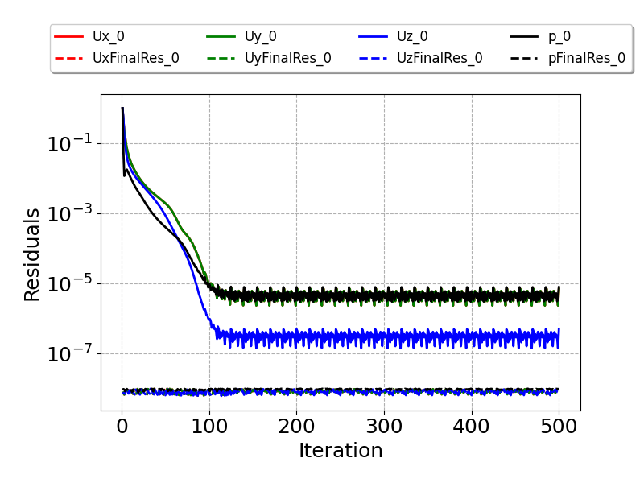
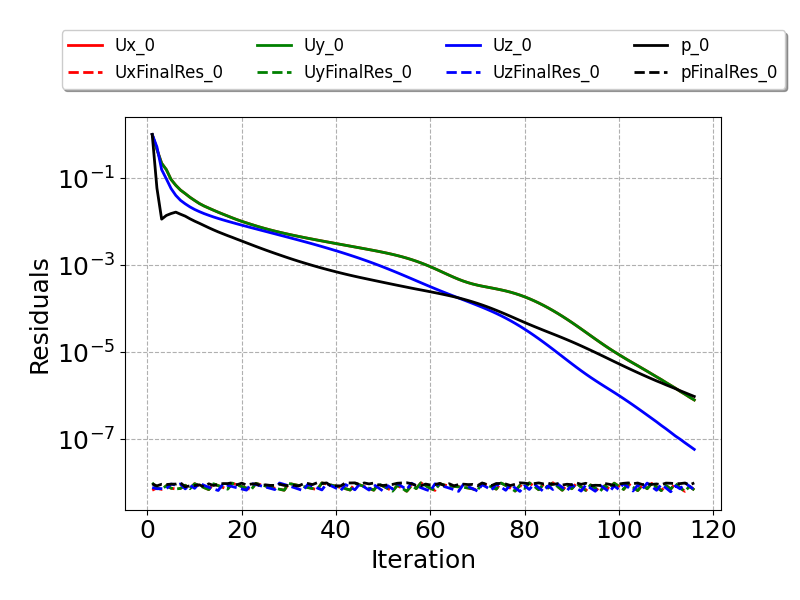

# OpenFOAM-pipe-HTC
#### author: abdurrahman.imren @ WA, USA Jul 2025
A fundamental heat transfer study using both OpenFOAM ORG (v12) and COM (v2406) versions. Heat transfer coefficient of a pipe is calculated. A constant heat flux is applied on the pipe walls. Before moving forward, please study the problem described in **Pipe_turbulent_flow_heat_transfer_CFD_analysis.pdf**. Examples can be easily tested on a modest Windows laptop using WSL Ubuntu 24.04. Some instructions are (assuming that user already installed WSL and Ubuntu 24.04):
- For a quick test, install the binary version of OpenFOAM v12 as instructed in https://openfoam.org/download/12-ubuntu/ .
- COM version is here: https://www.openfoam.com/news/main-news/openfoam-v2406 .
- Make sure that *pitzDailySteady* tutorial case is working.
- Ubuntu 24.04 encourages users to create their own Python environment. How to: first, cd ~

  **sudo apt install python3-venv**

  **python3 -m venv .myenv**

  Add ***'source ~/.myenv/bin/activate'*** line to ***.bashrc*** file. Reload ***.bashrc*** and install popular modules such as ***numpy, pandas, matplotlib, scipy*** using:

  **pip install xxx**

  This will load ***.myenv*** Python environment automatically. To exit, just use ***deactivate*** command.
  
- To test cases, execute ***run_all_parallel.sh*** script.
- After the completion of the run, change directory to ***plots***, and type ***python plot_logs_residual.py***. Study the results.

  Inputs of these two cases are identical. However, we are going to see the impact of implementation differences between COM and ORG versions (Both versions are not really compatible with each other anymore). ORG offers simplified function objects using ***#includeFunc*** keyword as well as traditional function objects. In case **pipeSteadyFixdFlux_v12**, ORG compatible function objects were defined in ***system/monitor***. Not all function objects work as expected in terms of printing frequency, e.g., yPlus, wallHeatFlux. However, workaround is to use ***purgeWrite*** feature in ***system/controlDict***.

  In addition, ORG version is not shipped with a heat transfer coefficient function object based on Newton's law of cooling. This function object is essential for our study. Here author provides a coded function object implementation. This is different from the examples given in tutorials. Example coded objects in tutorials are not accessible to the other function objects. To overcome, it is necessary to save them in OpenFOAM registry, for example ***htcoeff*** object in our case. Then, a pointer can call this object from the registry (see details in ***htcoeff*** object in ***monitor*** file). Why do we need to register? Because, ***htcSurfAveEntry*** and ***htcSurfAveFullyDev*** objects in ***monitor*** need access to ***htcoeff*** object. These objects calculate surface average value of the heat transfer coefficient.

  However, COM version is shipped with this heat transfer coefficient function object. An example ***htc_Tref*** object is in ***system/f2_heatTransferCoeff***. Author also provides its coded version there. User can compare the results of both implementations in the **log.solver**.

  Now, the bottleneck. Study ***system/fvSolution***. Solver absolute tolerance was set to 1e-8 and relative tolerance to 0. Therefore, final residuals will be lower or equal to 1e-8 at convergence. This setting is not the fastest but helpful to diagnose the issue if User noticed. OpenFOAM v-12 developers categorized and generalized the solvers using a modular approach. Here ***foamRun*** picks up ***fluid*** solver. Residuals plot from a ***foamRun*** case is shown:

    
It is seen that ***Uy*** and ***p*** did not converge to the target ***residualControl 1e-6*** value although linear solver converges to the final target value of 1e-8 . COM version is more conservative and keeps ***rhoSimpleFoam*** solver as a CFD tool. Corresponding residuals plot is:

***Uy*** and ***p*** converged fast and did not stall. This plot is also different from the figure in slide 5 of **Pipe_turbulent_flow_heat_transfer_CFD_analysis.pdf**. In that figure, there is, again, convergence but it takes longer. Because, in that case, SIMPLE algorithm was used. To enable, one should set ***consistent no*** and use SIMPLE recommended ***relaxationFactors***. However, for this case, SIMPLEC performed better.

In **Pipe_turbulent_flow_heat_transfer_CFD_analysis.pdf**, there are also some important notes on yPlus and turbulence model selection. This fundamental case examines not only 
velocity wall functions but also those for thermal. Hope you find this useful.  
